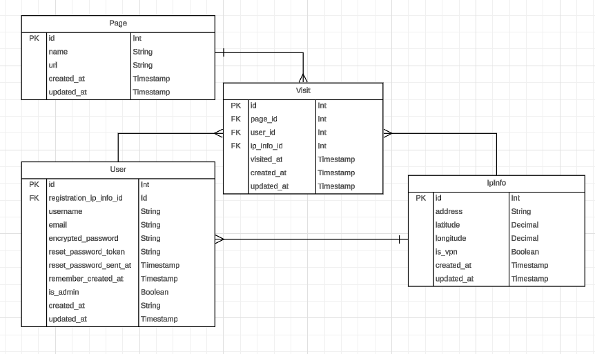

# traffic_backend

This is the backend repo for the Page Traffic application

<!-- vim-markdown-toc GFM -->

* [Requirements](#requirements)
* [Development](#development)
  * [Tests](#tests)
  * [Swagger](#swagger)
* [About](#about)
  * [Architectural decisions](#architectural-decisions)
  * [Page](#page)
  * [Visit](#visit)
  * [User](#user)
  * [IpInfo](#ipinfo)
  * [IpLocation](#iplocation)
  * [The API](#the-api)

<!-- vim-markdown-toc -->

## Requirements

* Ruby 3.3.0
* Rails 7.1.3
* Postgresql 16.1 (with collation [version
  2.39](https://dba.stackexchange.com/a/330184))

## Development

Create and migrate the development and test databases:

    rails db:create
    rails db:migrate

Run the server:

    rails s

The server should the run on [http://localhost:3000](http://localhost:3000)

### Tests

Unit tests can be run with rspec:

    rspec

and also with their test descriptions:

    rspec -f documentation

SimpleCov has been added to provide coverage statistics after each run. Reports
can be found at `coverage/index.html`

### Swagger

rswag is used for Swagger documentation. It depends on a number of request
specs in the test suite. After changes are made to these tests the following
command will generate the documentation (`swagger/v1/swagger.yaml`):

    rails rswag:specs:swaggerize

The docs can then be found at http://localhost:3000/api-docs

This command will run the spec files with rspec and check expectations:

    SWAGGER_DRY_RUN=0 rails rswag:specs:swaggerize

## About

This application will act as an API for the Page Traffic application which
models visits to pages with tracking enabled. [A separate frontend
application](https://github.com/kohrVid/traffic_frontend) will make requests to
this server before displaying the data in the UI.

### Architectural decisions

Below is an ERD for the project's models:

### Page

The `Page` model represents the pages in the frontend application that have
tracking enabled. As the location of these pages is quite arbitrary (they could
even have existed on a completely separate app that also makes a call to the
backend API), these must be created manually. At the moment, I use seeds to
insert these into a new database though in the future functionality could be
built to allow admin users to create these records in the UI.

The page-based routing in NextJS (the framework that the frontend application
is built in) does make the name of this model somewhat confusing. Were I to
start this project again, I think I would consider a more specific name (e.g.,
"TrackedPages") as an alternative.

### Visit

The `Visit` model is supposed to represent a single page visit. Details such as
the time of the visit (which is distinct from the `created_at` timestamp that
Rails provides as I anticipate that the table could be backfilled in the
future), the user ID (in the event that a user is logged in when visiting a
page, anonymous views are also recorded) and IP address are stored either in
this table or in associated records.  Whenever a user visits a page on the
frontend with tracking enabled, the page fires a POST request to this server
and creates a new Visit record. My local database already has over 170 records
in the `visits` table so in the future, strategies for scaling this data should
be explored.

In terms of serialising this data, I'm currently using `includes` in the Visits
controller to improve the joins generated in SQL queries (particularly where
page and IP data must be retrieved alongside the visit). I think it may be
necessary to paginate the response. I have a personal preference for not doing
this until absolutely necessary so for now, query strings that filter by page
or `visited_at` time can be used to limit the amount of records returned. I
think pagination presents a few issues for the frontend application, simply
because it was intended to present the visits on a map (which doesn't lend
itself well to pagination per se). Most likely, this is something for further
investigation.

### User

The `User` model represents a logged in user. Originally I only wanted to keep
track of assosicated visits and IP addresses, with things like the email
address and username being more of an afterthought. The use of Devise has
expanded the table significantly since then and there is now a distinction
between standard users and admins in the app (particularly on the frontend).

### IpInfo

The `IpInfo` model is used to represent a single IP Address and its location
data. The table essential records the address alongside its co-ordinates
(`latitude`, `longitude`) and keeps a note of whether the address is a known
VPN. Interestingly enough, the VPN status (which is derived from a third-party
API; see [the section below](#iplocation) for details) is not always accurate
and a number of the VPN tested have been recorded non-VPNs.

I decided that, as the formats for different IP address vary so much between
the two standard versions (IPv4 and IPv6), it wouldn't make much sense to
attempt to validate the structure of a given IP address before it was stored.
The address must be present as a requirement but [bogon
addresses](https://en.wikipedia.org/wiki/Bogon_filtering) or completely invalid
addresses (e.g., "meowmeow") could also be stored in the `ip_infos` table.
Further research is needed into how best to account for the different forms an
IP address can take as I would like to avoid making calls to third-party APIs
to check the location of IP addresses that aren't associated with a particular
location.

### IpLocation

The `IpLocation` service is used to make requests to a thrid-party API, the
[ipinfo.io](https://ipinfo.io) website lists geolocation data associated with a
given IP address. At the moment the service makes this requests whenever a new
`IpInfo` record is created in the database. In the future, I think it would be
a good idea the schedule this query (e.g., with a Sidekiq worker) in a way that
avoids the rate-limiting that they enforce. Collecting this information
pre-emptively (essentially scraping the ipinfo.io website) might be worth
considering if there are ever performance issues with the current approach.

I have some concerns about the name of this sevice. Both it and the `IpInfo`
class treat the "IP" accronym as a word which I believe isn't considered best
practice even though I personally find the class names easier to parse when
reading them than I do with the alternative. I suspect that the word "Location"
could be considered somewhat misleading as well however, as I currently use
this service to record VPN status and could theoretical record further details
about an address that have nothing to do with the geolocation.

### The API

I decided against using GraphQL for this project as I prefer to use that for
communication within a private network (e.g., behind a load balancer) due to
known [security issues with the
technology](https://escape.tech/blog/idor-in-graphql/). I've instead created a
more typical RESTful API which fits well with Rails conventions.

Though the backend is written in API-mode, session cookies are used for
authentication because [JWTs have their own security
issues](http://cryto.net/~joepie91/blog/2016/06/13/stop-using-jwt-for-sessions/).
Devise, which is something of a golden standard for Rails apps, is used for
authentication. Though it provides a lot out of the box, I felt that there was
only a need for user registration and functionality that would allow users to
log in and out. I have not enabled email confirmation or anything that requires
a mailer as I felt that this was out-of-scope for the task. A new `/users/auth`
endpoint has been added to the custom Devise controllers in order to support
server-side authentication.

As mentioned above, I have made Swagger documentation available for any future
collaborators to use.
